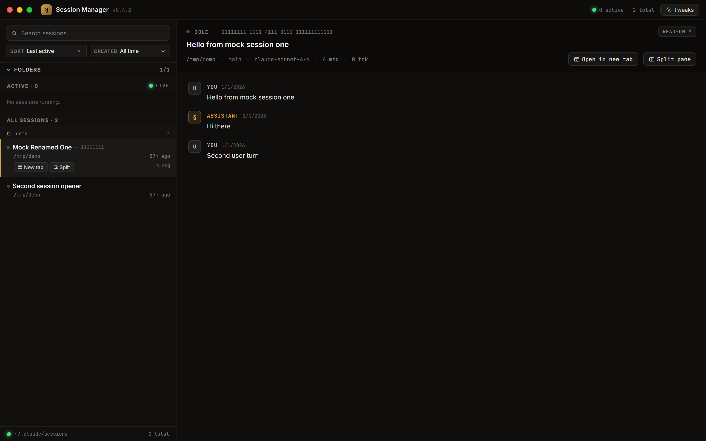
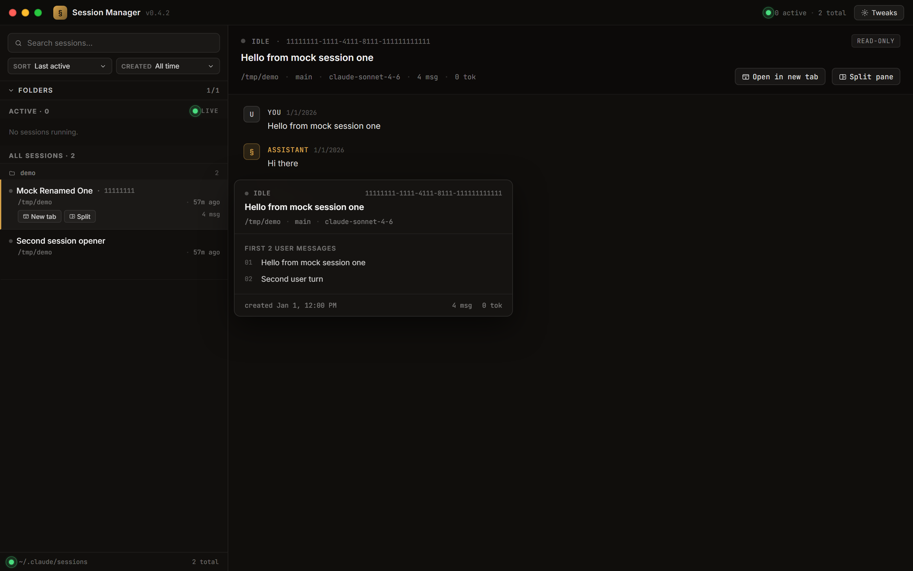

# AgentCLISessionManager — Claude Sessions Viewer

[](https://github.com/MenachemBarak/AgentCLISessionManager/actions/workflows/ci.yml)
[](https://github.com/MenachemBarak/AgentCLISessionManager/actions/workflows/security.yml)
[](LICENSE)
[](https://www.python.org/downloads/)
[](http://mypy-lang.org/)
[](https://github.com/astral-sh/ruff)

Desktop-launchable web UI that lists, previews, and resumes your [Claude Code](https://claude.com/claude-code)
sessions on Windows. Reads sessions directly from `~/.claude/projects/**/*.jsonl` — no API tokens,
no cloud round-trip.

## Screenshots

> Captured against the synthetic `tests/fixtures/claude-home` fixture —
> regenerate any time with `python scripts/capture_demo_screenshots.py`.



<details>
<summary>More views</summary>

**Hover preview** — peek at the first user messages of any session without opening it:



**Transcript** — click a session to read its history side-by-side:


</details>

## Features

- **Discovery** — lists every Claude Code session on the machine (sub-agent files filtered out)
- **Live** — SSE watcher surfaces new/updated sessions as they happen
- **Active** — detects currently-running sessions via `~/.claude/sessions/<pid>.json` + PID check
- **Resume** — "New tab" / "Split" buttons spawn `wt.exe ... claude --resume <uuid>`
- **Focus** — for active sessions, a `Focus` button switches the exact Windows Terminal tab to the front
  (UI Automation + OSC-0 title stamping via a Claude Code hook)
- **Folder filter** — per-project-folder checkboxes with *Only* / *All* / *None*; folders >1000 sessions auto-unchecked
- **Hover preview** — shows the first 10 user messages of any session
- **Inline rename** — click any session title to set a custom label, persisted in `~/.claude/viewer-labels.json`
- **Reads Claude's rename** — shows titles set via `/rename` inside Claude Code (`custom-title` JSONL entries)

## Install

Pick whichever fits. All four install paths are built and verified by the
[release workflow](.github/workflows/release.yml) on every tagged release.

### 1. Native Windows x64 app (no Python required)

Download `claude-sessions-viewer-<ver>-windows-x64.exe` from the
[Releases page](https://github.com/MenachemBarak/AgentCLISessionManager/releases/latest)
and double-click. A real desktop window opens — no browser, no terminal, no
Python install.

Requires Edge WebView2, which ships pre-installed on every Windows 11 machine.

### 2. `pipx` (recommended for CLI use)

```bash
pipx install git+https://github.com/MenachemBarak/AgentCLISessionManager.git@v0.4.0
claude-sessions-viewer
```

Once on PyPI:

```bash
pipx install claude-sessions-viewer
claude-sessions-viewer --help
```

`claude-sessions-viewer` accepts `--host`, `--port`, `--server-only`,
`--no-browser`, `--log-level`, and `--version`. Default mode opens a native
desktop window; `--server-only` runs headless and opens your browser.

### 3. Windows zip (source + launcher shortcut)

Download `claude-sessions-viewer-<ver>-windows.zip` from the
[Releases page](https://github.com/MenachemBarak/AgentCLISessionManager/releases),
extract, then:

```cmd
launcher\install-shortcut.bat
```

Creates a `Claude Sessions.lnk` on your Desktop. First double-click auto-creates
a venv and installs deps; subsequent launches just open the browser at
`http://127.0.0.1:8765`.

### 4. From source (for contributors)

```bash
git clone https://github.com/MenachemBarak/AgentCLISessionManager.git
cd AgentCLISessionManager
python -m venv .venv
.venv/Scripts/python -m pip install -e .
claude-sessions-viewer
```

## Requirements

- **Windows 11** (core focus; the backend runs on Linux/mac but `open`/`focus` are no-ops there)
- **Python 3.10+** on PATH
- **Windows Terminal** (`wt.exe`) for tab-level open/focus

## Architecture

| Layer       | Stack                                                          |
|-------------|----------------------------------------------------------------|
| Backend     | FastAPI + uvicorn on `127.0.0.1:8765`                          |
| Frontend    | React 18 via Babel-standalone (no build step)                  |
| Live feed   | `sse-starlette` + `watchdog` on `~/.claude/projects`           |
| Focus path  | `uiautomation` → OSC-0 tab titles stamped by SessionStart hook |
| Storage     | User labels: `~/.claude/viewer-labels.json`                    |

Key endpoints: `/api/sessions`, `/api/sessions/{id}/preview`, `/api/sessions/{id}/transcript`,
`/api/sessions/{id}/label` (GET/PUT), `/api/open`, `/api/focus`, `/api/status`, `/api/stream` (SSE),
`/api/hook/{install,uninstall,status}`.

## Configuration

| Env var       | Purpose                                                      | Default           |
|---------------|--------------------------------------------------------------|-------------------|
| `CLAUDE_HOME` | Override the `~/.claude` directory (tests / portable installs) | `~/.claude`     |
| `VIEWER_URL`  | Used by tests to target a non-default host/port              | `http://127.0.0.1:8765/` |

## Development

```bash
python -m venv .venv
.venv/Scripts/python -m pip install -r backend/requirements.txt
.venv/Scripts/python -m pip install pytest httpx ruff

# Run the full CI suite locally (no Claude Code install needed — uses fixtures):
.venv/Scripts/python -m pytest
.venv/Scripts/python -m ruff check backend hooks tests
.venv/Scripts/python -m ruff format --check backend hooks tests

# Start the server:
.venv/Scripts/python -m uvicorn app:app --app-dir backend --host 127.0.0.1 --port 8765
```

## Testing strategy

Unit/integration tests use a **mocked `CLAUDE_HOME`** fixture (`tests/fixtures/claude-home/`) with
two sample JSONL sessions plus a sub-agent file that must be filtered out. This means:

- **Zero dependency on a real Claude Code install** — tests run in GitHub Actions on Ubuntu
- **No tokens, no API calls** — every test is hermetic
- **Full endpoint coverage** — status, list, preview, transcript, label roundtrip, hook stamping

Playwright end-to-end tests (`tests/test_user_label_flow.py`, `tests/visual_check.py`) are kept
local-only — they require a running viewer + Chrome and are excluded from the default pytest run.

## Production hardening

| Check                  | Tool                              | Cadence                       |
|------------------------|-----------------------------------|-------------------------------|
| Lint                   | ruff                              | pre-commit + CI               |
| Format                 | ruff-format                       | pre-commit + CI               |
| Type-check             | mypy (strict-ish)                 | pre-commit + CI               |
| SAST                   | bandit                            | pre-commit + CI + weekly cron |
| CVE scan (Python deps) | pip-audit                         | CI + weekly cron              |
| Code scanning          | GitHub CodeQL (security-and-quality) | CI + weekly cron           |
| Dep freshness          | Dependabot (pip + actions)        | weekly                        |
| Auto-merge fixes       | `.github/workflows/dependabot-auto-merge.yml` | on every Dependabot PR (security + patch only, after CI green) |

See [`SECURITY.md`](SECURITY.md) for vulnerability disclosure and
[`CONTRIBUTING.md`](CONTRIBUTING.md) for the dev loop.

## License

[MIT](LICENSE)
